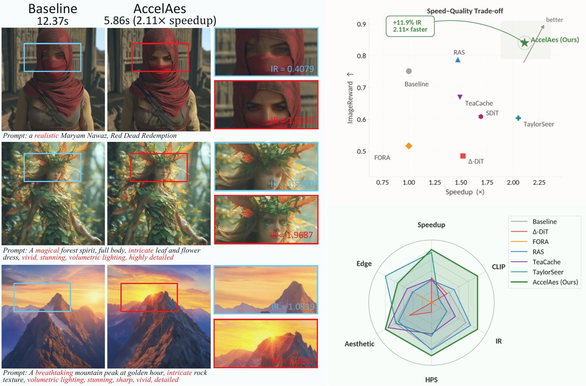

# AccelAes

**AccelAes** is a training-free DiT inference acceleration framework that combines aesthetic-aware sparse attention (AesMask) with frame-level step skipping (StepSkip), achieving **2.1× speedup** with improved image quality on Lumina-Next-T2I, FLUX.1-dev, and SD3-Medium.



## Results

### Multi-Backbone Results

| Backbone | Method | Time (s) | Speedup | CLIP Score | ImageReward | HPSv2 | Aesthetic Score | Edge Density |
|---|---|---|---|---|---|---|---|---|
| SD3-Medium | Baseline | 3.52 | 1.00× | 0.2662 | 0.879 | 0.2895 | 5.733 | 0.916 |
| SD3-Medium | **AccelAes** | **2.34** | **1.50×** | **0.2744** | **0.904** | **0.3014** | **5.990** | **0.944** |
| FLUX.1-dev | Baseline | 12.66 | 1.00× | 0.2753 | 1.233 | 0.3200 | 6.243 | 0.560 |
| FLUX.1-dev | **AccelAes** | **7.31** | **1.73×** | **0.2772** | **1.317** | **0.3214** | **6.372** | **0.590** |

### Lumina-Next-T2I Detailed Comparison

| Method | Time (s) | Speedup | CLIP Score | ImageReward | HPSv2 | Aesthetic Score | Edge Density |
|---|---|---|---|---|---|---|---|
| Baseline | 12.37 | 1.00× | 0.2531 | 0.752 | 0.2710 | 5.941 | 0.583 |
| Δ-DiT | 8.13 | 1.52× | 0.2523 | 0.485 | 0.2540 | 5.873 | 0.522 |
| FORA | 12.36 | 1.00× | 0.2463 | 0.517 | 0.2496 | 5.766 | 0.564 |
| RAS | 8.38 | 1.47× | 0.2550 | 0.788 | 0.2713 | 5.927 | 0.581 |
| SDiT | 7.30 | 1.69× | 0.2502 | 0.609 | 0.2538 | 5.822 | 0.429 |
| TeaCache | 8.28 | 1.49× | 0.2512 | 0.670 | 0.2640 | 5.978 | 0.599 |
| TaylorSeer | 6.02 | 2.05× | 0.2491 | 0.604 | 0.2650 | 5.940 | 0.668 |
| **AccelAes** | **5.86** | **2.11×** | **0.2640** | **0.841** | **0.2740** | **6.041** | 0.629 |

## Requirements

```
torch>=2.1.0
diffusers>=0.27.0
transformers>=4.38.0
accelerate>=0.27.0
open_clip_torch>=2.24.0
ImageReward>=1.5.0
hpsv2>=1.2.0
```

Full dependency list: see [`requirements.txt`](requirements.txt).

## Setup

```bash
# 1. Create environment
conda create -n accelaes python=3.10
conda activate accelaes

# 2. Install PyTorch (CUDA 12.1)
pip install torch==2.2.0 torchvision==0.17.0 --index-url https://download.pytorch.org/whl/cu121

# 3. Install dependencies
pip install -r requirements.txt

# 4. (Optional) Install aesthetic predictor
pip install git+https://github.com/LAION-AI/aesthetic-predictor.git

# 5. (Optional) Install PickScore
pip install git+https://github.com/yuvalkirstain/PickScore.git
```

Models are downloaded automatically from Hugging Face on first run:
- `Alpha-VLLM/Lumina-Next-SFT-diffusers`
- `stabilityai/stable-diffusion-3-medium-diffusers`
- `black-forest-labs/FLUX.1-dev`
- `openai/clip-vit-large-patch14`

## Usage

```python
from src.models.dit_wrapper import LuminaDiTWrapper

wrapper = LuminaDiTWrapper(dtype="bf16")
img = wrapper.generate_accelerated_dual(
    prompt="A peacock displaying its intricate iridescent plumage, photorealistic",
    seed=0,
    mask_type="semantic", region_method="threshold",
    skip_ratio=0.50, s_fg=7.0, s_bg=1.0, mask_step=5,
    full_skip_interval=2, sparse_ffn=True, sparse_blocks=True,
    cfg_scale=4.0, steps=30,
)
img.save("output.png")
```

## Evaluation

### Reproduce comparison results

```bash
# Lumina-Next-T2I (AccelAes + all baselines)
python scripts/run_p0_eval.py

# FLUX.1-dev (AccelAes + TeaCache + TaylorSeer)
python scripts/run_stepcache_fulleval.py

# SD3-Medium (AccelAes + all baselines)
python scripts/run_sd3_compare.py
```

### Evaluate your own outputs

```bash
python scripts/eval_metrics.py \
    --image_dir outputs/my_run \
    --prompts prompts/prompts_dev.txt \
    --output_json outputs/my_run/scores.json
```

Available metrics: `clip`, `ir` (ImageReward), `hps` (HPSv2), `aesthetic`, `edge`, `pickscore`.

## Repository Structure

```
src/
  models/      # Model wrappers (Lumina, FLUX, SD3)
  sparse/      # AesMask, sparse attention, skip cache
  baselines/   # Reproduced baselines (RAS, Δ-DiT, FORA, TeaCache, TaylorSeer)
  eval/        # Metric implementations
scripts/
  run_p0_eval.py           # Lumina-Next-T2I comparison
  run_sd3_compare.py       # SD3-Medium comparison
  run_stepcache_fulleval.py # FLUX.1-dev comparison
  eval_metrics.py          # Compute paper metrics on generated images
prompts/
  pickapic_all_unique.txt  # 10,000-prompt Pick-a-Pic evaluation set
configs/
  base.yaml                # Default hyperparameters
```

## Key Hyperparameters

```python
# AccelAes default (Lumina-Next-T2I)
mask_type        = "semantic"
region_method    = "threshold"
skip_ratio       = 0.50
s_fg             = 7.0      # foreground CFG scale
s_bg             = 1.0      # background CFG scale
mask_step        = 5        # mask refresh interval
full_skip_interval = 2      # skip every 2nd step
sparse_ffn       = True
sparse_blocks    = True
cfg_scale        = 4.0
steps            = 30
```
